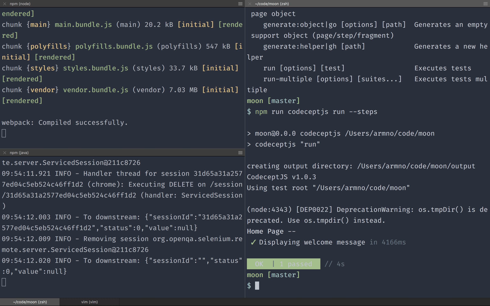

# angular-e2e-codecept-example

This is a companion repo for my blog article: [Setting up End-to-End Testing in Angular Project with CodeceptJS](https://medium.com/@armno/setting-up-end-to-end-testing-in-angular-project-with-codeceptjs-ac1784de3420).



## Set up

```sh
$ npm install
```

## Running E2E tests

1. Start local dev server: `$ npm start`.
2. Start Selenium server: `$ npm run wd:start`.
3. Run E2E test: `$ npm run codeceptjs`.
